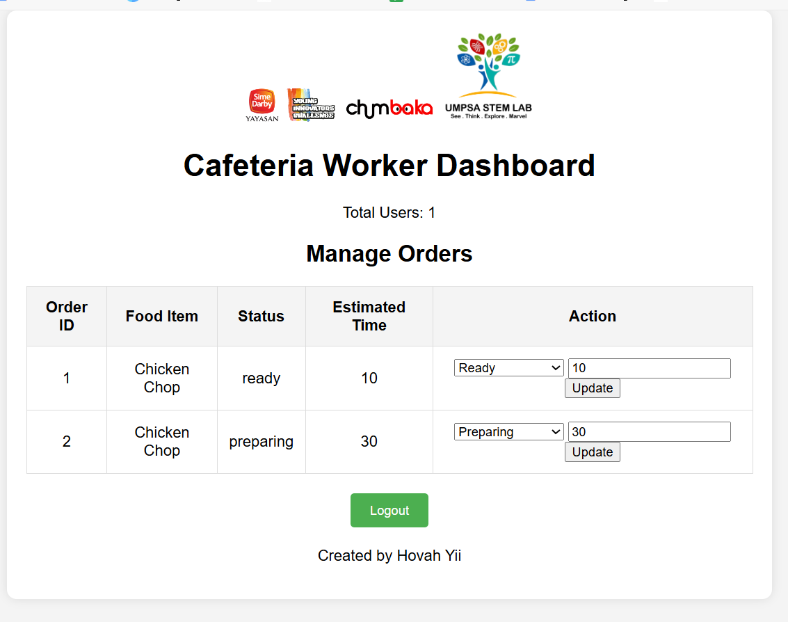

## CanteenBuddy

**CanteenBuddy** is a smart food ordering system designed to streamline the process of managing food orders in school cafeterias. By using an open-source microcontroller like the ESP32, CanteenBuddy helps reduce wait times, minimize errors, and enhance the overall dining experience for students while making the workflow easier for cafeteria workers.

### Screenshots

#### Student Order Page


#### Cafeteria Workers Dashboard


#### Real-Time Order Updates


### Features

- **Student Order Page**: An easy-to-use web interface where students can view the menu and place their orders.
- **Cafeteria Worker Dashboard**: A real-time dashboard for cafeteria workers to manage and update food orders.
- **Real-Time Updates**: An ESP32 microcontroller with an LCD screen to display the status of orders.
- **Notifications**: Automated notifications to inform students when their food is ready for pickup.

### Components

- **ESP32 Microcontroller**: Used to manage real-time updates and display order status on an LCD screen.
- **LCD Screen**: Displays the current status of food orders.
- **Web Interface**: For students to place orders and for workers to manage those orders.

### Installation

1. **Clone the repository:**
   ```bash
   git clone https://github.com/yourusername/CanteenBuddy.git
   cd CanteenBuddy

2. Set up the web server:
- Place the web files in your web server directory (e.g., xampp/htdocs/chumbaka).
- Import the canteen.sql file to set up the database.

3. Configure the ESP32:
- Upload the Arduino code to the ESP32.
- Ensure the ESP32 is connected to the correct Wi-Fi network (make sure the Wi-Fi does not block IP address).

4. Modify the configuration:
- Update the ESP32 IP address in the PHP files.

### Usage
1. Students: Visit the student order page, view the menu, and place an order.
2. Cafeteria Workers: Use the worker dashboard to view incoming orders and update their status.
3. Real-Time Updates: The ESP32 will display the status of orders on the LCD screen, and students will receive notifications when their order is ready.

### Like this project? You can show your appreciation by buying Hovah a coffee ☕

<a target="_blank" rel="noopener noreferrer" href="https://www.buymeacoffee.com/hovahyii"></a>

### Appreciation
We would like to express our appreciation to Sime Darby for sponsoring us the Arduino kits and Chumbaka for organising this wonderful Train the Trainer event. Sincerely from  UMPSA mentos.
